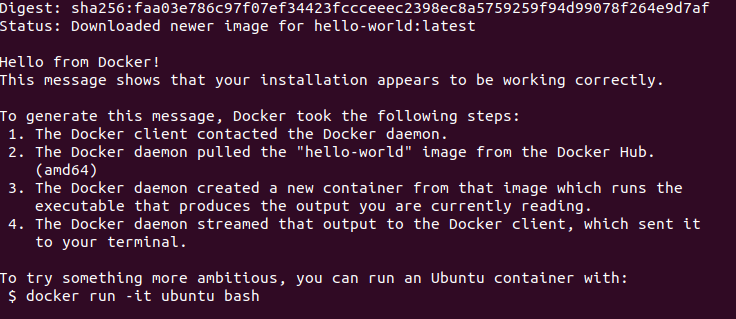
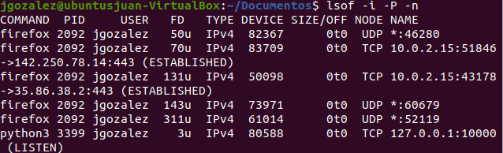

# Practica 1
**Por** *Juan Camilo Gonzalez Mulato*
## 1. Configuración del entorno: El estudiante deberá configurar su dispositivo de elección para ejecutar una imagen virtualizada de Linux, este será un suministro importante para el resto de prácticas.
### Se instaló la imagen de Linux Ubuntu y posteriormente se realizo las diferentes configuraciones del entorno.

## 2. Instalar docker
- Verifico si alguna version anterior de docker no este instalada

- Actualizo el apt índice del paquete:

- Se hace la instalación Docker Engine, containerd y Docker Compose.

- Verifico que la instalación de Docker Engine sea exitosa ejecutando la hello-worldimagen:

## 3. Reconocimiento de herramientas de red: Identificar configuración de red por medio del comando ip e ifconfig. Identificar servicios y puertos ocupados en el sistema con los comandos ss, netstat y lsof.
- Comando ip 
Aqui nos muestra todas las direciones ip que esta utilizando el sistema. 

- Comando ifconfig
Aqui nos muestra  varias interfaces que ha creado el sistemas con sus respetivas direciones ip conectadas

Ahora utilizando los comandos ss, netstat y lsof para mirar que puertos y servicios está utilizando el sistema. 

## 4. Identificar servicios desplegados: El estudiante deberá identificar 5 servicios diferentes listados por las herramientas de red y determinar a qué aplicaciones posiblemente están relacionados.
 Con el comando lsof | lees se se puede visualizar los servicios

- Systemd: el objetivo de encargarse de arrancar todo lo que está por debajo del Kernel, permitiendo ejecutar varios procesos de manera simultánea.
- Mm_percpu : asignador de memoria percpu
Rcu_gp: Son bits dentro del Kernel de Linux.
- Netns: gestión del espacio de nombres de la red de procesos.
- Kworker: es un proceso de marcador de posición para los subprocesos de trabajo del kernel, que realizan la mayor parte del procesamiento real para el kernel, especialmente en los casos en que hay interrupciones, temporizadores, E/S, etc. Por lo general, corresponden a la gran mayoría de cualquier asignación  "tiempo del sistema" para ejecutar procesos.

## 5. Evaluar scripts en Python: Al estudiante se le entregarán scripts en Python para desplegar un ejemplo de cliente servidor con protocolos TCP y UDP, el estudiante evaluará el rendimiento de los dos servicios y debe descubrir la ocupación de los puertos por medio de las herramientas previamente estudiadas.

### TCP 
Servidor

Cliente 

Se corre el servidor y luego el cliente 

Con el comando lsof -i -P -n  se puede ver los puertos ocupados por el protocolo TCP, por ejemplo, python3 está corriendo por el puerto 10000 con un servicio que esta a la escucha con el protocolo TCP ipv4, el cual está abierto para que se pueda acceder desde cualquier instancia 

### UDP
Servidor

Cliente 

Se corre el servidor y luego el cliente 

Con el comando lsof -i -P -n  se puede ver los puertos ocupados por el protocolo UDP, por ejemplo, python3 está corriendo por el puerto 10000 con un servicio que esta a la escucha con el protocolo UDP ipv4, el cual está abierto para que se pueda acceder desde cualquier instancia. 

Se puede decir que el protocolo UDP al prescindir de un sistema de verificación de ida y vuelta entre el dispositivo emisor y el dispositivo receptor, el protocolo UDP permite una velocidad de transferencia superior a la del protocolo TCP.