# Practica 2
**Por** *Juan Camilo Gonzalez Mulato*

**Nombre de la asignatura: Electiva IOT**

**Fecha de realización 29/11/2022**

## 1. Instalar servidor NodeJS y NestJS.
Instalamos nodo NodeJs
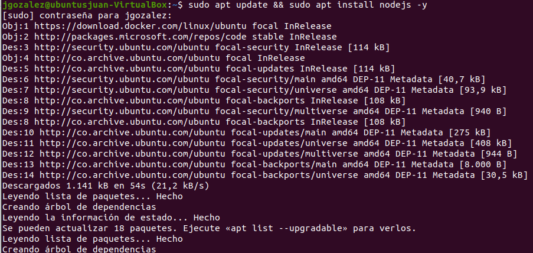

Validamos las versión
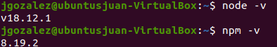

Ahora instalamos NestJS.
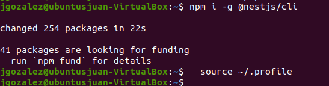

## 2. Implementar un servidor web que exponga un recurso REST.
Luego creamos un proyecto NestJS ejecutando el comando nest new
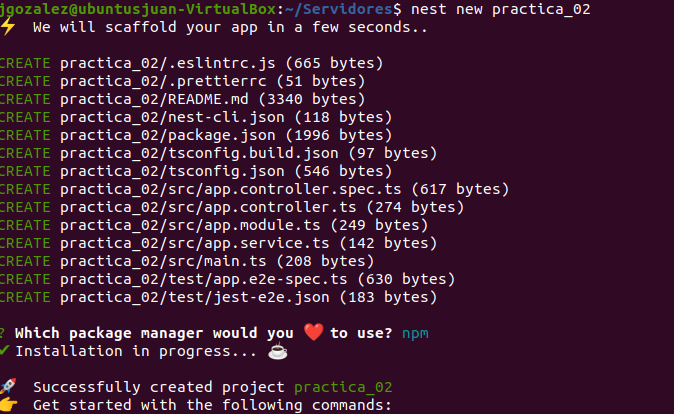

identificamos la dirección IP de la máquina
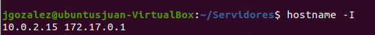

Se verifica los scripts disponibles
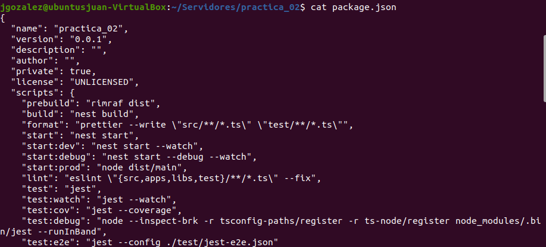

Con lo anterior el servidor nos indica que está listo para recibir peticiones con el metodo GET en la ruta raíz. Por defecto el servidor escucha en el puerto 3000, para verificar esto se puede ejecutar el comando en otra terminal:
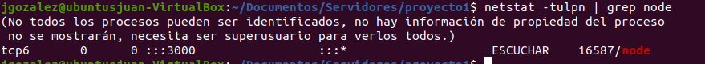

Luego Se ejecuta el ejemplo Hello World
Ejecutamos el servidor
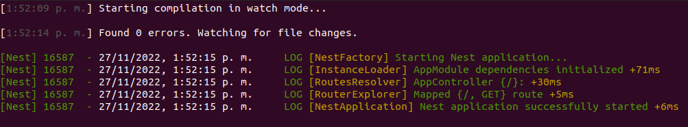

Ahora nos conectamos  la servidor y nos muestra "Hello World!"
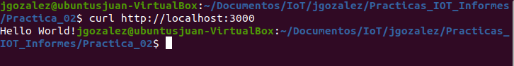

## 3. Identificar los verbos Http y su uso para un caso de ejemplo
**Este ejemplo de implementación de los verbos HTTP se hizo acerca de productos.**

En el archivo app.controller.ts
creamos una interfaz de Producto
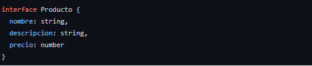

Luego creamos la clase Producto y  creamos un producto.
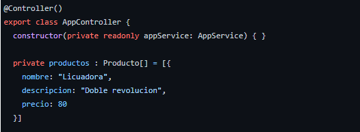

Luego creamos una metodo GET  para solicitar una representación de productos
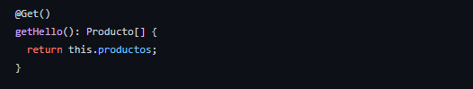

Creamos una metodo POST para crear un producto. 
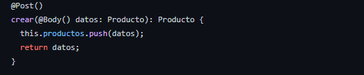

Creamos una metodo PUT para Actualizar un producto. 
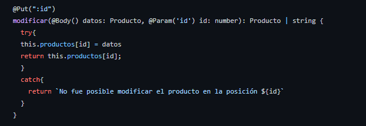

Creamos una metodo DELETE para eliminar un producto. 
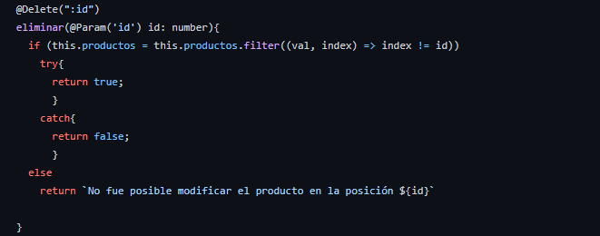

Creamos una metodo PATCH para actualizar un producto parcialmente. 
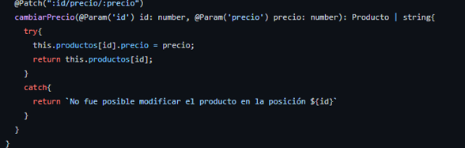

## Evaluación del funcionamiento de los verbos.
En este caso se utilizo la herramienta Postman para evaluar los verbos.

GET 
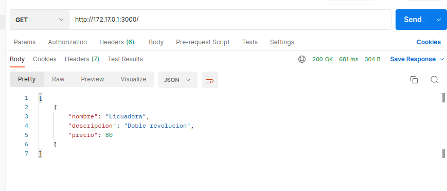

POST
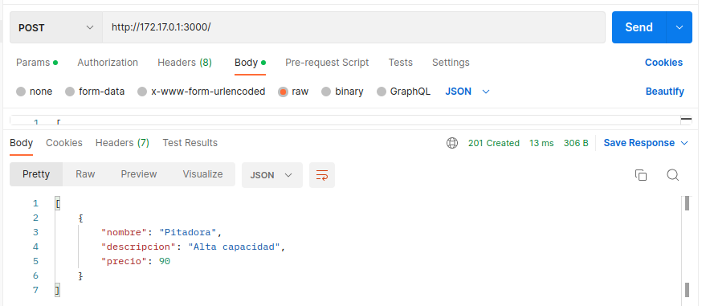

PUT
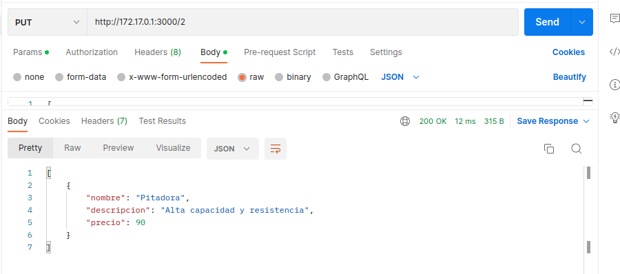

DELETE
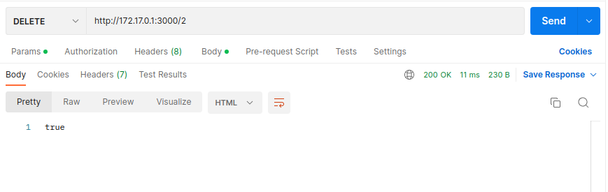

PATCH
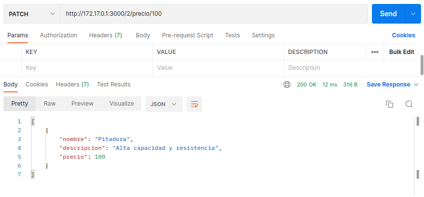