# Practica 3 Seguridad y calidad
**Por** *Juan Camilo Gonzalez Mulato*

# Objetivos
- Aplicar los conceptos de arquitectura hexagonal.
- Implementar protección simple de endpoints.
- Implementar autenticación JWT.

# I. Arquitectura hexagonal
Se realizo la respectiva modulacion del proyecto con la arquitectura exagonal. 

# II. Implementado seguridad
En esta parte se implemento un sistema de autenticación y autorización para que los usuarios puedan acceder a los recursos del servidor.

-Primero se instala  el paquete @nestjs/passport y passport, que permitirá implementar la autenticación y autorización y luego se creará un módulo para autenticación .

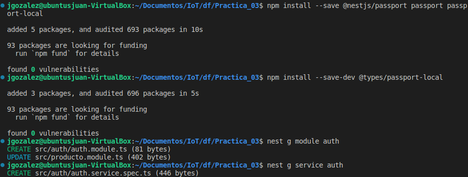

-Luego se crea un módulo para gestionar usuarios

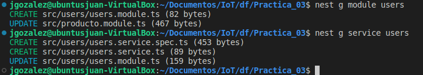

-Luego se realizo la implemnteacion y las modificaciones a las respectivas clases

-Luego se hizo la validación.En este punto al llamar al enpoint POST del servidor la respuesta debería ser esta:

Prueba en postman

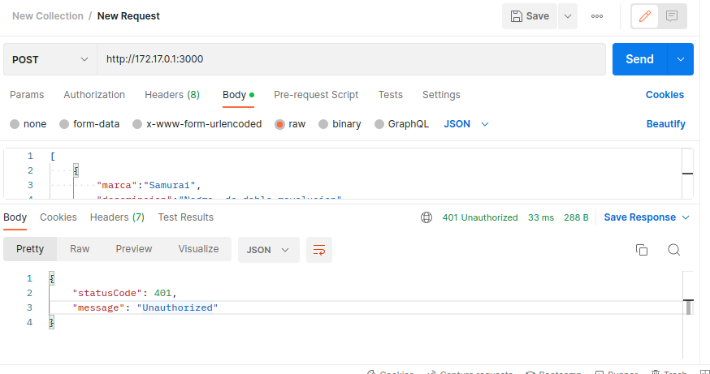

# III. Autenticación con JWT
-Para implementar la autenticación con JWT se instalo el paquete @nestjs/jwt
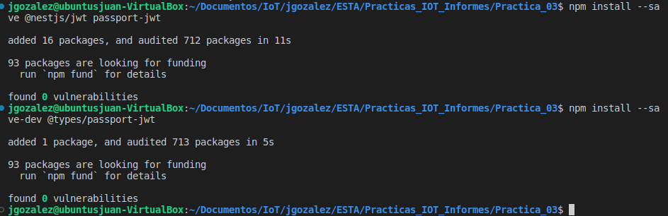

 -Luego se realizo Luego se realizó la respectiva implementación y modificación de los archivos, para garantizar la Autenticación con JWT.

Tambien se protegió los endpoints que tengan capacidad de modificar o eliminar registros
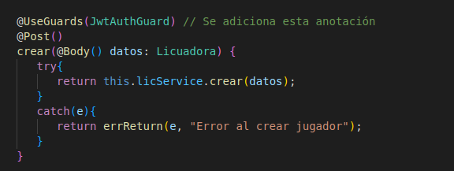
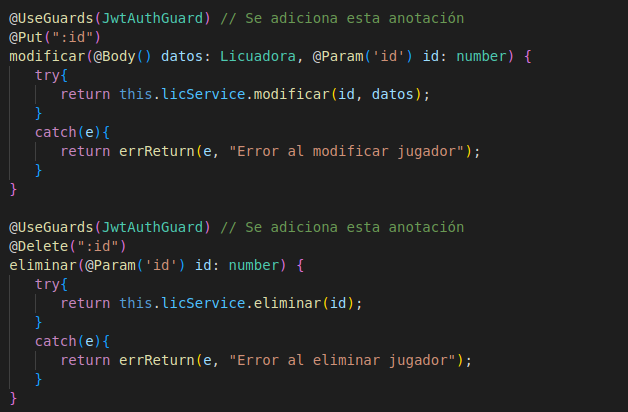
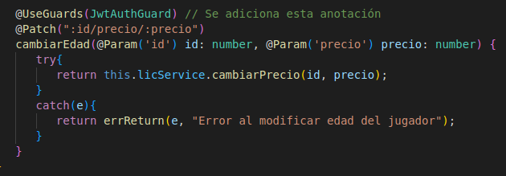

-Finalmente se realiza la prueba  del funcionamiento en postaman

Primero se hace le inicia sesión, y este nos genera un token para la autenticación.

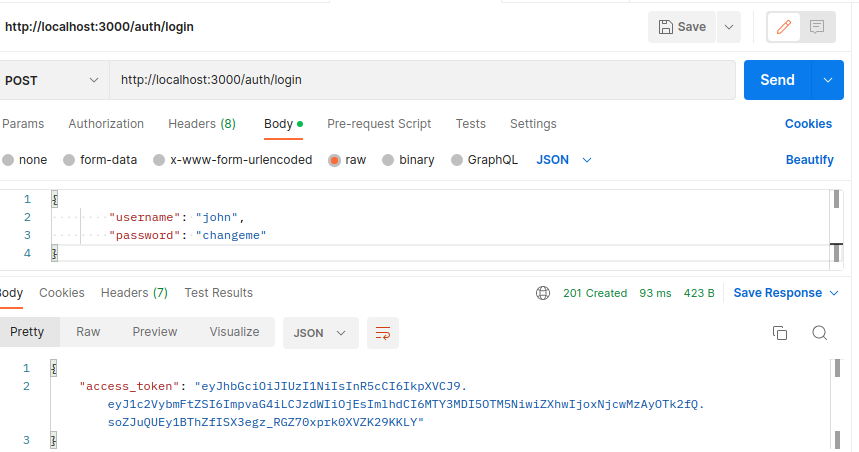

Luego  se verifica el correcto funcionamiento de los endpoints protegidos.

Se crea un producto con POST

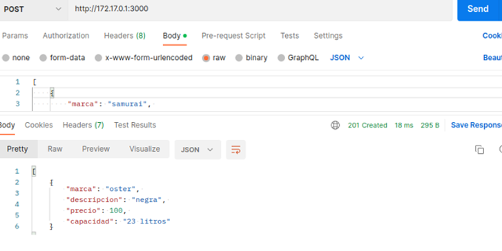

Se modifica el producto con PUT

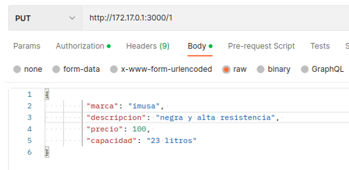

Se modifica el precio del producto con PATCH

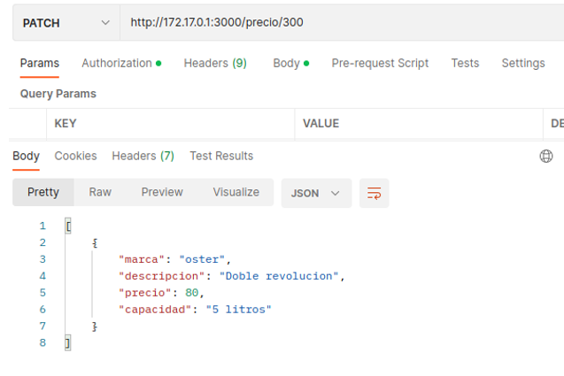

Se lista el productpo con GET
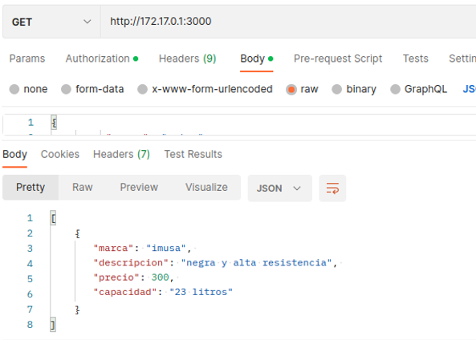

Por ultimo se elimina el producto con DELETE

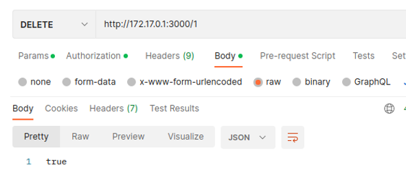

