# Práctica 4: Desplegando en la nube
**Por** *Juan Camilo Gonzalez Mulato*

## Objetivos
1. Desplegar una aplicación en la nube.
2. Agregar una base de datos a la aplicación.

## 1. Desplegar una aplicación en la nube
Se descargar deta ejecutando el siguiente comando.

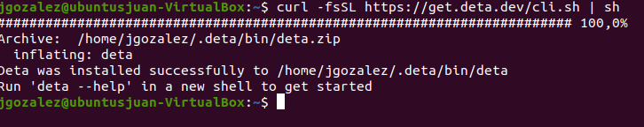

luego se hace la las implementaciones y modificaciones necesarias para el despliegue 

Para poublicar la aplicación ejecutando en la terminal el comando:

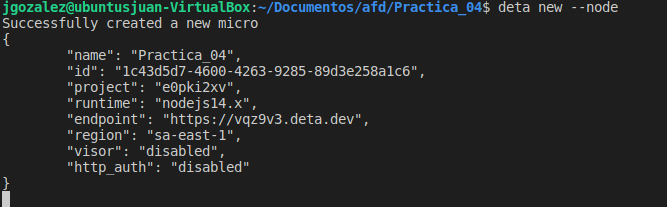
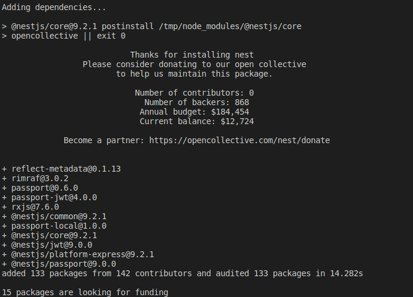

Después se despliega la aplicación y posterior se activan los logs ejecutando en la en la terminal:

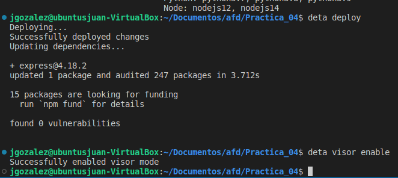

Prueba de la aplicacion desplega en la nube en DETA

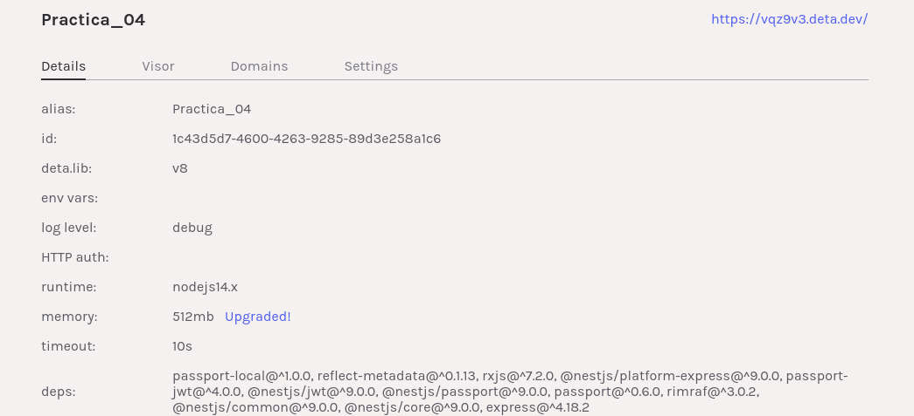

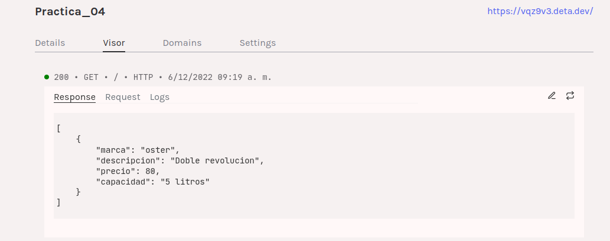

 Ingresando al link obtenido https://vqz9v3.deta.dev Se obtiene la respuesta implementada en el método get del servicio:

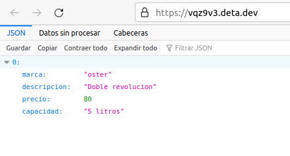

## 2. Conectado a una base de datos
Se realizó el registro y la respectiva configuración de la base de datos en MongoDB.

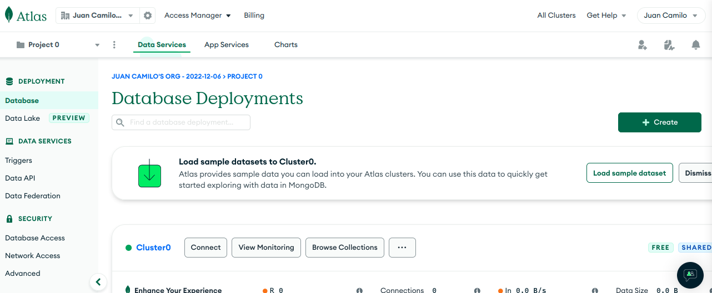

luego se hizo las respectivas implementación y modificaciones a los archivos.

Por último, se hizo la validación de la conexión con la base de datos en Postman.

Primero se hace un GET para verificar que la base de datos este vacía

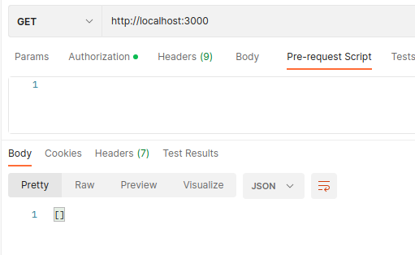

Luego se inserta un producto con POST

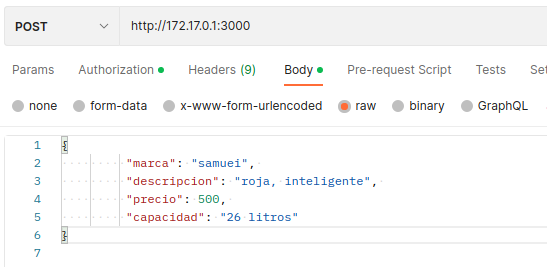

Por ultimo se hace un GET para listar el elemento

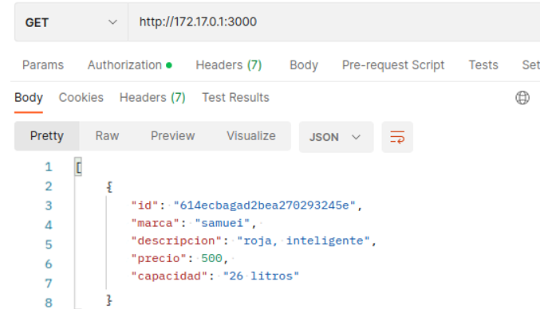

 Esto quiere decir que la conexión con la base de datos fue exitosa.
